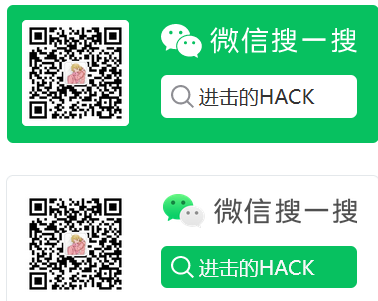

# SecurityLearnNote
 网络安全学习笔记

持续更新中

欢迎关注公众号：进击的HACK

## 优秀的github项目

### SRC赏金

https://github.com/reddelexc/hackerone-reports

该项目爬取了HackerOne上前100的漏洞报告，而且分门别类了，不同的漏洞类型和不同项目的漏洞TOP100

## Android安全

**入门**

如何用最简单的办法逆向破解 https://mp.weixin.qq.com/s/GRZOuTqBwxXJmOWrq_9w-A

**进阶**

某 APP 聊天协议逆向 https://bbs.kanxue.com/thread-276591.htm

Magisk源码编译及踩坑一览 https://bbs.kanxue.com/thread-276622.htm

## IOS渗透测试

IOS渗透测试指南 https://mp.weixin.qq.com/s/FOFLRg0eqOVKghtOYlQcVA

